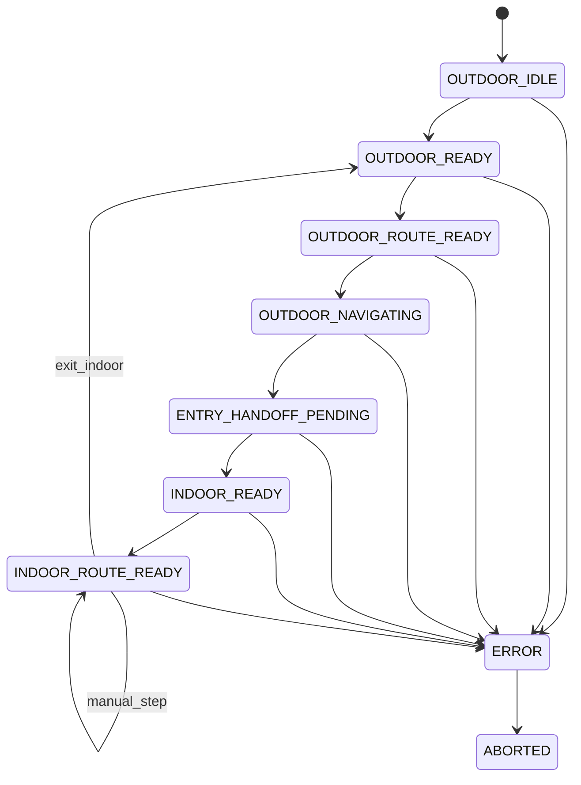

# App 状态机与 ImageProvider 规格 v0.1

更新时间：2026-05-06

## 1. 文档目的

本文档定义 Android App 当前有效的运行时状态机口径，以及图像来源抽象 `ImageProvider` 的角色边界。

本文档同时区分两层含义：

- 当前 Android Demo 的真实实现口径
- 保留在代码中的云端室内链路能力

## 2. 当前范围与约束

- 室外导航使用真实高德 SDK
- 室外终点为最接近目标店铺的入场口
- 室内目标点为店铺门口 POI
- 室外到室内切换当前仍以手动 `Enter Venue` 为准
- 当前室内默认模式为 `manual_demo`
- 云端视觉重定位与室内路径规划代码保留，但默认关闭，不作为当前室内主链路
- 图像来源需要支持降级兜底，避免单一 provider 故障导致整条链路不可用

## 3. 当前 Android Demo 实现口径

### 3.1 当前已落地能力

当前 Android App 已具备以下事实能力：

- 真实高德室外导航
- 室外当前位置获取、POI 搜索、骑行 / 步行算路
- 室外导航中的回到当前位置、车头向上 / 北向上、全览、退出导航
- 外部高德地图 App 兜底
- 手动 `Enter Venue` / `Exit Indoor`
- 室内高德底图宿主 `MapView`
- 室内 `manual_demo` 手动演示脚本
- 室内方向键和楼层按钮推进
- `glasses_album_sync / glasses_thumbnail / phone_camera_fallback`
- Debug 面板中的健康检查、元数据、视觉定位、室内路径规划、低置信度和 provider fallback 调试入口

### 3.2 当前未实现边界

以下内容不应写成“当前已实现”：

- 自动室外切室内
- 自动入场判断
- 真实眼镜 SDK 接入
- 真实连续视觉重定位闭环
- 真实室内动态重算路
- `glasses_private_stream` 作为当前默认 provider

### 3.3 当前默认室内模式

```text
IndoorNavigationMode =
  "manual_demo" |
  "cloud_relocalization"
```

当前默认值：

```text
manual_demo
```

含义：

- 进入室内后，默认加载预置演示脚本
- 室内导航推进依赖用户按键
- 默认不触发 `Capture & Locate`
- 默认不触发 `Request Route`
- 云端链路只保留在 Debug 面板

## 4. 当前状态机

### 4.1 当前实际使用状态

当前代码中保留以下状态：

- `OUTDOOR_IDLE`
- `OUTDOOR_READY`
- `OUTDOOR_ROUTE_READY`
- `OUTDOOR_NAVIGATING`
- `ENTRY_HANDOFF_PENDING`
- `INDOOR_READY`
- `INDOOR_CAPTURING`
- `INDOOR_LOCATING`
- `INDOOR_LOW_CONFIDENCE`
- `INDOOR_ROUTING`
- `INDOOR_ROUTE_READY`
- `ERROR`
- `ABORTED`

### 4.2 当前主链路使用方式

当前真实主链路只稳定使用以下状态组合：

| 状态 | 当前含义 |
| --- | --- |
| `OUTDOOR_IDLE` | 室外未准备，等待用户输入或定位 |
| `OUTDOOR_READY` | 室外参数就绪，可准备路线 |
| `OUTDOOR_ROUTE_READY` | 室外路线已生成 |
| `OUTDOOR_NAVIGATING` | 室外导航进行中 |
| `ENTRY_HANDOFF_PENDING` | 已到入口或接近入口，等待手动交接 |
| `INDOOR_READY` | 室内底图和手动脚本已就绪 |
| `INDOOR_ROUTE_READY` | 手动演示已激活，等待按键推进 |
| `ERROR` | 当前流程发生可见错误 |
| `ABORTED` | 演示被手动中止 |

### 4.3 当前默认不进入的室内状态

以下状态仍保留在代码中，但在当前 `manual_demo` 模式下不属于默认室内主流程：

- `INDOOR_CAPTURING`
- `INDOOR_LOCATING`
- `INDOOR_LOW_CONFIDENCE`
- `INDOOR_ROUTING`

这些状态属于保留的云端链路能力。

## 5. 当前主流程状态图



## 6. 手动室内演示状态语义

### 6.1 `INDOOR_READY`

- 室内底图宿主已激活
- 脚本已加载
- 当前楼层、起点、目标点和首条提示已可生成

### 6.2 `INDOOR_ROUTE_READY`

- 当前室内主演示态
- 等待用户通过 `上 / 左 / 右 / 下 / 楼层按钮` 推进
- 当前点、目标点、已完成段、待执行段和提示文案都应可见

### 6.3 `ERROR`

- 手动脚本异常
- 室内底图异常
- 楼层切换异常
- 当前状态卡必须展示可理解错误

## 7. 保留云端链路状态语义

当显式切回 `cloud_relocalization` 或 Debug 手动触发时，保留链路仍可使用：

- `INDOOR_CAPTURING`
- `INDOOR_LOCATING`
- `INDOOR_LOW_CONFIDENCE`
- `INDOOR_ROUTING`

但这条链路当前不应被写成默认室内主流程。

## 8. ImageProvider 规格

### 8.1 Provider 角色

| Provider ID | 当前角色 | 当前口径 |
| --- | --- | --- |
| `glasses_album_sync` | 首选演示 provider | 保留并可调试 |
| `glasses_thumbnail` | 次级演示 provider | 保留并可调试 |
| `phone_camera_fallback` | 最稳定兜底 provider | 保留并可调试 |
| `glasses_private_stream` | 未来扩展 provider | 当前未接入主流程 |

### 8.2 当前默认优先级

```text
glasses_album_sync
-> glasses_thumbnail
-> phone_camera_fallback
```

### 8.3 当前模式下的使用方式

在 `manual_demo` 模式下：

- provider 不参与室内主导航推进
- provider 状态仍展示在顶部卡片和 Debug 面板
- provider fallback、低置信度和失败模拟仍可在 Debug 中演示

在保留的 `cloud_relocalization` 模式下：

- provider 才参与 `Capture & Locate`

### 8.4 统一接口

```text
interface ImageProvider {
  id(): ProviderId
  capabilities(): ProviderCapabilities
  start(session: NavigationSession): ProviderStartResult
  stop(sessionId: string): void
  health(): ProviderHealth
  capture(request: CaptureRequest): CaptureResult
}
```

## 9. 当前关键运行数据

### 9.1 NavigationSession

```json
{
  "session_id": "session_20260506_0001",
  "venue_id": "venue_demo_001",
  "target_poi_id": "poi_store_a",
  "state": "OUTDOOR_NAVIGATING",
  "active_provider": "glasses_album_sync"
}
```

### 9.2 ManualIndoorDemoState

```json
{
  "mode": "manual_demo",
  "route_id": "demo_route_001",
  "current_step_id": "step_003",
  "current_floor_id": "F1",
  "instruction": "前方右转",
  "expected_action": "right",
  "can_step_back": true,
  "is_arrived": false
}
```

## 10. 当前验收口径

当前阶段验收重点如下：

1. 室外高德导航主流程稳定。
2. `Enter Venue` 后默认进入 `manual_demo`。
3. 室内按键推进、楼层切换、回退和重置逻辑清晰可控。
4. 室内地图能展示当前位置、目标点和路径状态。
5. 云端链路保留在 Debug 面板，不冒充当前主流程。
