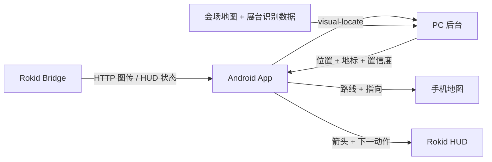

# 展馆实时室内导航演示系统快速说明 V0.1

更新时间：2026-06-10

## 1. 一句话说明

VisionRoute 展馆室内导航演示系统通过 Rokid 眼镜 HTTP 图传向 Android 手机提供用户视野图像，手机把图像上传到同 Wi-Fi 局域网内的 PC 后台 `visual-locate`，PC 后台使用 `scene_classifier` 或备用识别模式返回展台 / 地标定位结果，App 再基于会场地图和路网生成导航路线，并在手机和 Rokid HUD 上同步展示导航指向。

详细规格见：[展馆实时室内导航演示系统整体设计](./exhibition-indoor-navigation-demo-system-design-v0.1.md)。

## 2. 核心目标

- 在会场内根据 Rokid 上传图像识别展台 / 地标，并估计当前位置。
- 支持展台号和设施搜索，例如 `B17`、`F05`、厕所、报告厅。
- 在手机端展示室内地图、当前位置、路线和下一动作。
- 在 Rokid 眼镜端展示简化方向箭头和下一动作。
- 通过同 Wi-Fi 局域网完成手机 App 与 PC 后台联调。
- 保留 Rokid IMU 航向字段和 HUD 能力；当前定位结果不依赖 `imu_at_capture` 才能返回。

## 3. 系统链路



主链路分为四步：

1. PC 后台在同 Wi-Fi 局域网内启动，并通过 `/debug/pairing` 提供 `baseUrl`。
2. Android App 配置或扫码连接 PC 后台，确认 `/api/v1/health` 可访问。
3. Rokid Bridge 通过 HTTP 图传把会场图像送到手机，手机上传 `visual-locate`。
4. PC 后台用 `scene_classifier` 或备用识别模式返回当前位置附近的地图坐标。
5. Android App 基于当前位置和目标点规划路线，在手机地图和 Rokid HUD 上展示导航提示。

## 4. 模块职责

| 模块 | 主要职责 |
| --- | --- |
| Rokid Bridge | HTTP 图传、状态上报、会场小地图 HUD、路线和动作提示 |
| Android App | PC 配对、图像上传、展台搜索、路径规划、地图展示、HUD 下发 |
| PC 后台 | `visual-locate`、`scene_classifier`、最近请求、配对页、调试页 |
| 会场地图与识别数据 | 维护底图、展台、设施、路网、地标和分类标签 |
| 路径规划模块 | 生成当前位置到目标点的路线和下一动作 |

## 5. 定位方式

系统不依赖完整 SLAM 或高精视觉重定位作为主演示链路，而是使用 PC 后台展台级识别结果进行定位：

- 当前默认识别模式为 `scene_classifier`。
- `scene_retrieval`、`template`、`mock` 和 `real_ocr_adapter` 作为备用或调试模式。
- OCR / LOGO / 海报识别仍作为设计方向保留，可在后续替换 adapter 时接入。
- 地标库将识别结果绑定到 `landmark_id`、`poi_id`、`route_node_id` 或 `route_edge_id`。
- App 将识别结果吸附到展馆地图中的位置附近，再进入导航状态。

## 6. IMU 使用边界

Rokid IMU 只用于方向，不用于位置。

| 允许用途 | 禁止用途 |
| --- | --- |
| 记录拍照瞬间镜头方向 | 使用 IMU 独立计算当前位置 |
| 在视觉校准间隔内更新用户朝向 | 使用 IMU 长时间推算轨迹 |
| 计算导航箭头相对方向 | 使用手机 IMU 替代眼镜 IMU |
| 辅助生成左转、右转、直行提示 | 使用手机姿态代表佩戴者视角 |

手机可能位于口袋、背包、车架或手持姿态变化较大的位置，因此手机端 IMU 不参与用户航向估计。Rokid 眼镜端 IMU 不可用时，系统进入航向不可用或航向过期状态。

## 7. 关键数据

### 7.1 地标数据

```json
{
  "landmark_id": "lm_booth_b10_logo_front",
  "floor_id": "F1",
  "poi_id": "poi_booth_b10",
  "route_node_id": "node_f1_b10_front",
  "aliases": ["B10", "展台B10", "品牌名"],
  "template_images": ["landmarks/b10/logo_front_01.jpg"]
}
```

### 7.2 定位响应

```json
{
  "status": "ok",
  "floor_id": "F1",
  "position": {
    "x": 42.1,
    "y": 18.7
  },
  "confidence": 0.82,
  "matched_landmark": {
    "landmark_id": "lm_booth_b10_logo_front",
    "poi_id": "poi_booth_b10"
  }
}
```

## 8. 用户可见效果

- 用户搜索 `B17` 或 `F05` 后，App 匹配目标展台。
- Rokid 眼镜看到展台画面后，系统识别当前位置附近的展台 / 地标。
- 手机地图显示当前位置、目标点和路线。
- Rokid HUD 显示箭头和下一动作，例如“直行”“右转”“到达 B10 展台附近”。
- 模拟步行时，手机地图和 Rokid HUD 同步刷新当前位置与提示词。
- 识别低置信度或航向过期时，手机和 HUD 显示对应状态，不输出强方向结论。

## 9. 网络模式

| 模式 | 连接方式 | 特点 |
| --- | --- | --- |
| 同 Wi-Fi 局域网 | 手机和 PC 连接同一个 Wi-Fi，App 使用 `http://<PC局域网IP>:8000` | 当前默认链路 |
| Tailscale | 手机使用 5G，PC 使用场馆 Wi-Fi，通过 Tailscale 互联 | 仅作为备用网络模式 |

App 需通过手动输入或 `/debug/pairing` 扫码获取 PC 后台 `baseUrl`，并提供健康检查状态。

## 10. 验收口径

- 手机和 PC 同 Wi-Fi 时，手机浏览器可访问 PC 后台 `/api/v1/health`。
- App 可通过手动配置或扫码配对保存 PC 后台 `baseUrl`。
- Rokid HTTP 图传图像能够进入 Android App。
- Android App 能够请求 PC 后台 `visual-locate`。
- PC 后台能够返回展台 / 地标定位结果。
- App 能够将位置显示到室内地图。
- 展台搜索能够解析到目标展台或设施。
- App 能够生成路线和下一动作。
- Rokid HUD 能够显示方向箭头和下一动作。
- 系统不会使用手机 IMU 作为航向来源。
