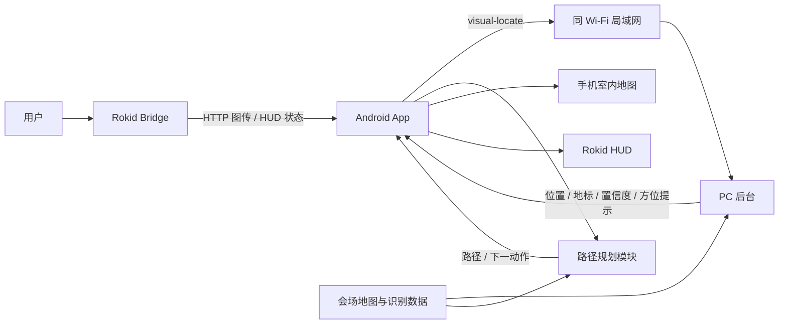
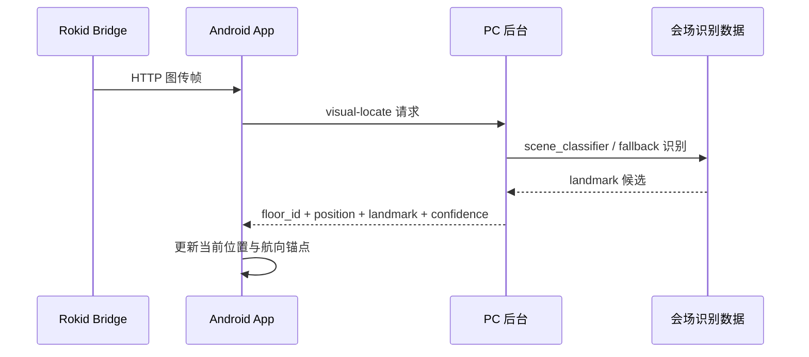
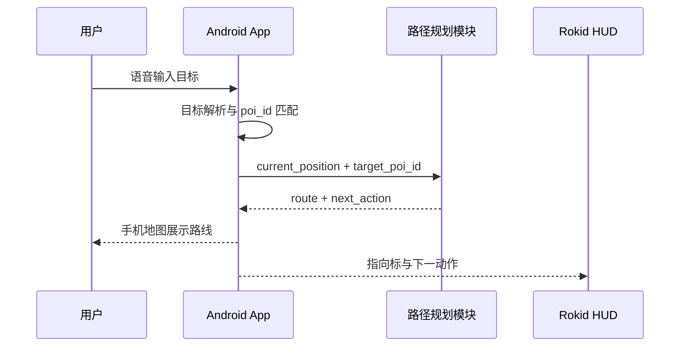

# 展馆实时室内导航演示系统整体设计 V0.1

更新时间：2026-06-10

## 1. 文档目的

本文档定义 VisionRoute 在展馆场景下的实时室内导航演示系统整体设计，覆盖 Rokid Bridge HTTP 图传、Android 手机 App、同 Wi-Fi PC 后台、会场地图数据、`scene_classifier` 展台识别、Rokid HUD、手机地图展示和保留的 Rokid IMU 航向辅助接口。

本文档作为 Android、识别服务、建图标注和现场部署协作的统一技术规格。

## 2. 业务场景

目标场景为展馆内部导航。场馆内存在数十个展台，以及厕所、报告厅、出入口、服务台等公共设施。展台通常具备 LOGO、海报、展板、展位号或品牌文字等可识别视觉地标。

用户佩戴 Rokid 眼镜并携带 Android 手机。Rokid Bridge 通过 HTTP 图传将当前视野图像传给手机，手机在同 Wi-Fi 局域网内上传到 PC 后台 `visual-locate`。PC 后台当前默认使用 `scene_classifier` 展台分类器返回用户所在位置附近的地图坐标和识别置信度。Android App 基于当前位置、目标展台和路网计算路线，在手机端展示地图定位和导航提示，并在 Rokid 眼镜端 HUD 展示简化方向指向标。

## 3. 设计目标

- 支持通过 Rokid 眼镜采集当前视野图像。
- 支持在拍照或取帧瞬间记录 Rokid 眼镜端 IMU 航向数据。
- 支持 Android App 通过同 Wi-Fi 局域网访问 PC 后台。
- 支持将 Rokid HTTP 图传图像从手机发送到 PC 后台。
- 支持基于 `scene_classifier` 和备用识别模式进行展台级位置估计。
- 支持将识别结果吸附到展馆地图中的 landmark、booth、facility、route_node 或 route_edge。
- 支持展台号和设施搜索，例如 `B17`、`F05`、厕所、报告厅。
- 支持 Android 手机端展示室内地图、当前位置、路径、下一动作和楼层信息。
- 支持 Rokid 眼镜端展示简化导航指向标、下一动作、目标名称和航向状态。
- 保留 `imu_at_capture` 和 Rokid IMU 航向桥接接口；当前 PC 后台定位不依赖 IMU 才能返回。

## 4. 非目标范围

- 不使用手机端 IMU 作为用户航向来源。
- 不依赖手机姿态判断佩戴者朝向。
- 不使用 IMU 独立推算用户位置。
- 不接入完整 SLAM 或高精视觉重定位作为主演示链路。
- 不把 Rokid 真实语音识别作为当前主演示入口。
- 不把 Tailscale 作为当前默认网络链路。
- 不实现无地图自由探索导航。
- 不实现多场馆在线运营平台。
- 不在眼镜端展示完整复杂地图。

## 5. 总体架构



系统采用“PC 后台展台识别定位 + App 路网导航 + Rokid HUD 同步”的组合方案。PC 后台负责提供位置校准，App 路径规划模块负责将当前位置与目标展台连接到可通行路线，Rokid HUD 负责展示手机端下发的地图、路线和下一动作。

## 6. 核心链路

### 6.1 图像定位链路



### 6.2 导航链路



## 7. 子系统职责

### 7.1 Rokid 眼镜端

- 通过 Camera2 低 FPS 按需 HTTP 图传提供用户视野图像。
- 提供 HTTP `/status` 状态。
- 接收 Android App 下发的 HUD 更新。
- 显示会场小地图、当前位置圆点、路线、目标点和下一动作。
- 保留眼镜端 IMU 姿态数据接口，当前定位结果不依赖 IMU。

### 7.2 Android App

- 管理 Rokid 设备连接状态。
- 接收 Rokid HTTP 图传图像。
- 通过手动输入或扫码配对保存 PC 后台 `baseUrl`。
- 向 PC 后台发送图像定位请求。
- 解析搜索输入并匹配目标展台或设施。
- 管理当前位置、航向锚点、路径、导航状态和低置信度状态。
- 展示手机端室内地图、当前位置、路径和导航提示。
- 向 Rokid HUD 下发简化导航信息。

### 7.3 PC 后台

- 接收 Android App 上传的图像和上下文参数。
- 运行 `scene_classifier` 展台分类器作为当前默认识别模式。
- 保留 `scene_retrieval`、`template`、`mock`、`real_ocr_adapter` 备用模式。
- 输出匹配的 landmark、floor_id、position、confidence 和可选 `heading_hint`。
- 记录请求日志、识别候选、失败原因和耗时。

### 7.4 展馆地图与地标库

- 维护楼层图、展台、公共设施、出入口、通道、障碍区和路网。
- 维护 OCR / LOGO / 海报 / 展位号对应的 landmark 数据。
- 维护 landmark 与 booth、poi、route_node、route_edge 的绑定关系。
- 维护同名或相似品牌的歧义处理规则。

### 7.5 路径规划模块

- 基于当前位置和目标点计算室内路线。
- 支持展台、厕所、报告厅、出口等目标类型。
- 生成下一动作、剩余距离、剩余时间和跨楼层提示。
- 生成手机地图路线覆盖物和眼镜 HUD 指向信息。

## 8. 地图与地标数据模型

### 8.1 展馆目标点

```json
{
  "poi_id": "poi_booth_b10",
  "type": "booth",
  "display_name": "B10 展台",
  "floor_id": "F1",
  "position": {
    "x": 42.1,
    "y": 18.7
  },
  "route_node_id": "node_f1_b10_front"
}
```

### 8.2 视觉地标

```json
{
  "landmark_id": "lm_booth_b10_logo_front",
  "venue_id": "venue_exhibition_main",
  "floor_id": "F1",
  "poi_id": "poi_booth_b10",
  "route_node_id": "node_f1_b10_front",
  "display_name": "B10 展台 LOGO",
  "landmark_type": "logo",
  "aliases": ["B10", "展台B10", "品牌名"],
  "map_heading_deg": 90.0,
  "visibility_area": {
    "route_edge_ids": ["edge_f1_main_aisle_03"],
    "max_distance_m": 8.0
  },
  "template_images": [
    "landmarks/b10/logo_front_01.jpg",
    "landmarks/b10/poster_left_01.jpg"
  ]
}
```

### 8.3 路网节点

```json
{
  "node_id": "node_f1_b10_front",
  "floor_id": "F1",
  "x": 42.1,
  "y": 18.7,
  "node_type": "booth_front",
  "poi_id": "poi_booth_b10"
}
```

## 9. 定位请求与响应

### 9.1 请求字段

识别请求复用现有 `visual-locate` 语义，面向展馆地标识别可增加以下字段：

| 字段 | 类型 | 必填 | 说明 |
| --- | --- | --- | --- |
| `request_id` | string | 是 | 请求 ID |
| `capture_id` | string | 是 | 图像采集 ID |
| `venue_id` | string | 是 | 展馆 ID |
| `capture_timestamp_ms` | integer | 是 | 图像采集时间 |
| `capture_mode` | string | 是 | Rokid 实时取帧使用 `glasses_private_stream`，Rokid 拍照同步使用 `glasses_album_sync`，手机拍照 fallback 使用 `phone_camera_fallback` |
| `candidate_floor_id` | string | 否 | App 当前认为的楼层 |
| `target_poi_id` | string | 否 | 当前导航目标 |
| `imu_at_capture` | object | 否 | Rokid 眼镜端 IMU 样本 |
| `image` | file | 是 | 图像帧 |

### 9.2 响应字段

```json
{
  "request_id": "req_1777358700000",
  "status": "ok",
  "venue_id": "venue_exhibition_main",
  "floor_id": "F1",
  "position": {
    "x": 42.1,
    "y": 18.7
  },
  "confidence": 0.82,
  "matched_landmark": {
    "landmark_id": "lm_booth_b10_logo_front",
    "poi_id": "poi_booth_b10",
    "match_source": "logo_template",
    "display_name": "B10 展台 LOGO"
  },
  "heading_hint": {
    "map_heading_deg": 90.0,
    "source": "landmark_facing",
    "confidence": 0.7
  },
  "latency_ms": 680
}
```

## 10. 识别策略

### 10.1 当前默认识别模式

当前 PC 后台默认识别模式为 `scene_classifier`，面向会场展台级定位：

- 使用 MobileNetV3 Small 展台分类器。
- 当前样本、检索库和联调目标不纳入现场不存在的 `A11`。
- 服务端通过 `visual-locate` 返回 `ok / low_confidence / not_found / error`。
- `imu_at_capture` 当前只记录，不作为服务端返回定位结果的必要条件。
- `scene_retrieval` 保留为检索式备用路线。
- `template` 和 `mock` 保留为调试模式。
- `real_ocr_adapter` 保留为真实 OCR / LOGO adapter 替换点。

### 10.2 OCR 识别

OCR 识别用于处理：

- 展位号。
- 品牌文字。
- 报告厅名称。
- 厕所、出口、服务台等导视文字。
- 海报上的主标题或醒目标识。

OCR 结果需要进行大小写、空格、标点、全角半角和中英文别名归一化，再与 landmark aliases 进行匹配。

### 10.3 LOGO / 海报识别

LOGO / 海报识别用于处理：

- 品牌 LOGO。
- 展台主视觉海报。
- OCR 难以稳定识别的艺术字。
- 无明显文字但视觉特征稳定的展台元素。

识别服务可采用模板匹配、局部特征匹配、轻量向量检索或组合策略输出候选地标。候选结果必须包含匹配分数、候选数量和歧义标识。

### 10.4 置信度融合

定位置信度由以下因素共同决定：

- OCR 文本置信度。
- alias 匹配强度。
- LOGO / 海报匹配分数。
- 几何一致性。
- 候选 landmark 唯一性。
- `candidate_floor_id` 一致性。
- 当前路线先验一致性。
- landmark 可视区域一致性。
- 同名展台或相似海报歧义。

状态输出分为：

| 状态 | 含义 | App 行为 |
| --- | --- | --- |
| `ok` | 定位结果可用于更新当前位置 | 更新地图位置与航向锚点 |
| `low_confidence` | 命中候选但存在歧义 | 显示候选或请求重新采图 |
| `not_found` | 未识别到可靠地标 | 保持当前位置并提示重新面向地标 |
| `error` | 服务异常或请求无效 | 显示错误并保留本地状态 |

## 11. Rokid IMU 航向融合

本系统仅使用 Rokid 眼镜端 IMU 作为航向来源。手机可能处于口袋、背包、车架或任意手持姿态，手机端 IMU 不参与航向估计。

视觉定位成功后，App 以视觉结果建立航向锚点：

```text
heading_anchor = visual_position + map_heading + imu_yaw_at_capture
```

视觉校准有效期内，App 使用 Rokid IMU yaw 增量更新当前地图航向：

```text
current_map_heading = anchor_map_heading + normalize(current_imu_yaw - anchor_imu_yaw)
```

IMU 只更新用户朝向，不更新用户位置。位置仍由视觉地标识别、人工楼层状态、地图吸附和路线约束提供。

## 12. 语音导航

### 12.1 语音输入

Android App 负责处理语音输入，支持以下命令类型：

| 命令类型 | 示例 | 解析结果 |
| --- | --- | --- |
| 展台导航 | 导航到 B10 展台 | `target_poi_id=poi_booth_b10` |
| 公共设施 | 去厕所 | 最近厕所 POI |
| 报告厅 | 导航到主报告厅 | 报告厅 POI |
| 控制命令 | 重新定位 | 触发采图定位 |
| 控制命令 | 退出导航 | 结束当前导航 |

语音识别结果需经过目标解析器映射到 `poi_id`。当存在多个候选时，App 应展示候选列表并等待确认。

### 12.2 导航播报

导航播报由 App 根据路线状态生成，语音内容需与手机地图和 Rokid HUD 的下一动作保持一致。

## 13. 手机端 UI

手机端为完整导航主界面，展示内容包括：

- 展馆室内地图。
- 当前楼层。
- 当前定位点。
- 当前用户朝向。
- 目标展台或设施。
- 路线折线。
- 下一动作。
- 剩余距离和预计时间。
- 图像识别状态。
- 航向状态。
- 低置信度提示。
- 设备连接状态。

手机端需提供以下控制：

- 开始 / 停止导航。
- 目标搜索或语音输入。
- 重新采图定位。
- 楼层切换。
- 重新校准航向。
- 网络模式与服务地址配置。

## 14. Rokid HUD

眼镜端 HUD 展示简化导航信息，避免承载完整地图。HUD 内容包括：

- 方向箭头。
- 下一动作文本。
- 目标名称。
- 当前楼层。
- 到下一动作的距离。
- 航向状态。
- 低置信度或重新定位提示。

HUD 指向标由 App 根据 `relative_bearing` 生成，不由眼镜端独立计算路线。

## 15. 网络部署模式

### 15.1 同 Wi-Fi 局域网模式

同 Wi-Fi 局域网模式是当前默认链路。Android 手机与 PC 连接同一个 Wi-Fi，PC 后台监听 `0.0.0.0:8000`，App 使用 PC 局域网 `baseUrl` 访问后台。

| 项目 | 规格 |
| --- | --- |
| 手机网络 | 与 PC 连接同一个 Wi-Fi |
| PC 网络 | 与手机连接同一个 Wi-Fi |
| 服务地址 | `http://<PC局域网IP>:8000` |
| 配对入口 | `http://<PC局域网IP>:8000/debug/pairing` |
| 优点 | 延迟可控，不依赖公网，现场排查直接 |
| 约束 | 需要 Windows 防火墙放行 Python / 8000 端口，多网卡环境需确认正确 IP |

### 15.2 Tailscale 公网互联模式

Tailscale 模式只作为备用网络模式。当手机和 PC 无法连接同一个 Wi-Fi 时，双方通过同一 Tailscale tailnet 访问。

| 项目 | 规格 |
| --- | --- |
| 手机网络 | 5G |
| PC 网络 | 场馆 Wi-Fi 或有线网络 |
| 服务地址 | `http://<tailscale-ip>:<port>` |
| 优点 | 无需手机与 PC 位于同一局域网 |
| 约束 | 依赖公网连通性、Tailscale 登录状态和防火墙配置 |

系统需在 App 配置中明确当前 `baseUrl`，并在联调面板展示健康检查结果。当前现场优先使用同 Wi-Fi 局域网模式。

## 16. 状态机

| 状态 | 说明 | 主要入口 |
| --- | --- | --- |
| `IDLE` | 系统待机 | App 启动 |
| `DEVICE_CONNECTED` | Rokid 连接可用 | 眼镜连接成功 |
| `MAP_READY` | 展馆地图已加载 | 场馆包加载成功 |
| `CAPTURING` | 正在采集图像 | 自动采图或手动重新定位 |
| `LOCATING` | 正在识别定位 | 请求 PC / 云端服务 |
| `LOCALIZED` | 已获得当前位置 | `status=ok` |
| `NAVIGATING` | 正在导航 | 目标解析并生成路线 |
| `LOW_CONFIDENCE` | 定位低置信度 | `status=low_confidence` |
| `HEADING_BRIDGING` | 使用 IMU 短时航向桥接 | 无新增视觉校准且航向锚点有效 |
| `ARRIVED` | 到达目标附近 | 距离目标阈值内 |
| `ERROR` | 服务或设备异常 | 网络、识别、地图或设备错误 |

## 17. 日志与可观测性

系统需记录以下关键事件：

- Rokid 连接状态变化。
- 图像采集事件。
- IMU 样本绑定事件。
- 图像上传请求。
- OCR / LOGO / 海报候选。
- 定位结果。
- 航向锚点更新。
- 语音目标解析。
- 路线规划结果。
- HUD 下发事件。
- 网络健康检查。
- 错误码与失败原因。

日志必须包含 `request_id`、`capture_id`、`venue_id`、`floor_id`、`target_poi_id` 和 `latency_ms`，以支持端到端问题追踪。

## 18. 验收标准

- Rokid 眼镜图像能够进入 Android App。
- 手机与 PC 同 Wi-Fi 时，App 能通过手动配置或扫码配对访问 PC 后台。
- Android App 能够向 PC 后台发送图像定位请求。
- PC 后台能够通过 `scene_classifier` 或备用识别模式返回地标候选。
- App 能够将 `ok` 定位结果吸附到展馆地图坐标。
- App 能够根据搜索输入解析目标展台或设施。
- App 能够从当前位置规划到目标点的室内路线。
- 手机端能够显示地图、当前位置、路径和下一动作。
- Rokid HUD 能够显示与手机端一致的方向指向和下一动作。
- Rokid HUD 能够与手机地图保持当前位置、路线和下一动作一致。
- Rokid IMU 不可用时，系统不会切换到手机 IMU 作为航向来源。
- 低置信度、未识别、网络错误和设备断开均有明确 UI 状态。

## 19. 风险与边界

| 风险 | 影响 | 控制方式 |
| --- | --- | --- |
| 相似 LOGO 或重复展位标识 | 定位歧义 | 地标库记录多候选并结合楼层、路线和可视区域 |
| 海报反光、遮挡或模糊 | 识别失败 | 提示重新面向地标并重新采图 |
| 网络延迟或断连 | 定位结果滞后 | App 保留最近位置并展示网络状态 |
| Rokid IMU 漂移 | 方向误差累积 | 设置航向桥接有效期并通过视觉校准刷新 |
| 手机处于口袋或背包 | 手机姿态无效 | 禁止使用手机 IMU 作为航向来源 |
| 地图标注误差 | 路径和位置偏差 | 现场标注时绑定地标、POI 和路网节点 |

本设计以展馆视觉地标定位作为当前位置校准来源，以 Rokid IMU 作为短时方向连续性来源，以 Android App 作为主控和主展示终端，以 Rokid HUD 作为轻量导航指向终端。
