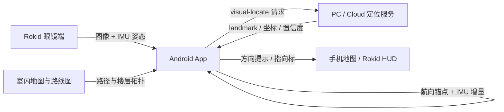

# Rokid IMU 航向辅助与视觉校准融合设计 V0.1

更新时间：2026-06-05

## 1. 文档目的

本文档定义 VisionRoute 室内导航场景中 Rokid 眼镜 IMU 数据的采集、传输、融合和展示规格，用于在视觉地标识别结果之间维持短时航向连续性，并记录图像采集瞬间的镜头朝向。

本文档覆盖眼镜端 IMU 采集、Android App 状态管理、PC/云端定位请求元数据、导航指向计算和置信度降级策略。

## 2. 设计范围

### 2.1 包含范围

- 拍照瞬间记录眼镜端 IMU 姿态数据。
- 将 IMU 姿态元数据随图像定位请求传递给 PC/云端。
- 基于视觉地标识别结果建立航向校准锚点。
- 在无新增视觉校准结果时，使用 IMU 航向增量维持短时方向估计。
- 基于当前航向和路径方向生成手机端地图箭头、文字提示和眼镜端指向标。
- 对航向数据进行时效、来源和置信度管理。

### 2.2 不包含范围

- 使用 IMU 独立完成室内位置定位。
- 使用 IMU 长时间推算用户轨迹。
- 使用步态检测、计步器、PDR 或惯导积分计算绝对位置。
- 替代 OCR / LOGO / 海报 / 导视牌等视觉地标定位结果。
- 替代场馆地图包、路线图和楼层切换逻辑。

## 3. 术语定义

| 术语 | 定义 |
| --- | --- |
| 视觉校准 | 通过 OCR、LOGO、海报或导视牌识别，将当前位置吸附到地图中的 landmark、route_node 或附近坐标 |
| 航向锚点 | 一次可信视觉校准结果与同一时刻 IMU yaw 之间建立的绑定关系 |
| IMU 航向桥接 | 在视觉校准结果缺失期间，根据 IMU yaw 变化量更新用户朝向 |
| 地图航向 | 地图坐标系中的用户面向方向，单位为度，范围为 `[0, 360)` |
| 相对指向 | 目标方向相对用户当前面向方向的角度，用于生成直行、左转、右转、掉头等导航提示 |

## 4. 总体架构



系统采用“视觉定位提供绝对约束，IMU 提供短时相对航向”的融合模式。视觉地标识别结果负责修正用户在地图中的位置，IMU yaw 增量负责维持视觉校准间隔内的朝向连续性。

## 5. 数据来源

### 5.1 唯一航向数据源

Rokid 眼镜端通过 Android 传感器能力读取旋转向量或等价姿态数据，输出 yaw、pitch、roll、时间戳和精度标识。眼镜端数据通过 Rokid `CUSTOMAPP` 自定义指令链路或等价通道传输到手机端。

### 5.2 数据源约束

手机端 Rotation Vector、方向传感器、磁力计或陀螺仪不得作为用户航向来源。室内导航过程中手机可能位于口袋、车架、背包或手持姿态变化较大的位置，手机姿态不能代表佩戴者视角，也不能代表 Rokid 摄像头拍摄方向。

当 Rokid 眼镜端 IMU 数据不可用时，系统应进入 `heading_unavailable` 或 `stale_heading` 状态，而不是切换到手机端 IMU 作为备用航向。

## 6. 数据模型

### 6.1 IMU 样本

```json
{
  "source": "rokid_imu",
  "imu_timestamp_ms": 1777358700008,
  "yaw_deg": 128.4,
  "pitch_deg": -3.2,
  "roll_deg": 1.1,
  "accuracy": "medium",
  "sample_age_ms": 42
}
```

字段说明：

| 字段 | 类型 | 必填 | 说明 |
| --- | --- | --- | --- |
| `source` | string | 是 | 固定为 `rokid_imu` |
| `imu_timestamp_ms` | integer | 是 | IMU 样本采集时间戳 |
| `yaw_deg` | number | 是 | 水平航向角，范围归一化到 `[0, 360)` |
| `pitch_deg` | number | 否 | 俯仰角 |
| `roll_deg` | number | 否 | 横滚角 |
| `accuracy` | string | 否 | `high`、`medium`、`low` 或 `unknown` |
| `sample_age_ms` | integer | 否 | 该样本相对当前处理时刻的年龄 |

### 6.2 拍照事件

```json
{
  "capture_id": "cap_1777358700000_001",
  "capture_timestamp_ms": 1777358700000,
  "capture_mode": "glasses_thumbnail",
  "imu_at_capture": {
    "source": "rokid_imu",
    "imu_timestamp_ms": 1777358700008,
    "yaw_deg": 128.4,
    "pitch_deg": -3.2,
    "roll_deg": 1.1,
    "accuracy": "medium",
    "sample_age_ms": 8
  }
}
```

拍照事件必须将图像时间戳与最近可用 IMU 样本绑定。若最近 IMU 样本超过系统允许时效，则该拍照事件不得声明 `imu_at_capture` 为有效航向。

### 6.3 航向锚点

```json
{
  "anchor_id": "heading_anchor_1777358702000",
  "venue_id": "venue_expo_main",
  "floor_id": "F1",
  "position": {
    "x": 42.1,
    "y": 18.7
  },
  "landmark_id": "lm_booth_b10_logo",
  "map_heading_deg": 90.0,
  "imu_yaw_deg": 128.4,
  "created_at_ms": 1777358702000,
  "confidence": 0.82
}
```

航向锚点由可信视觉校准结果生成。`map_heading_deg` 可由识别地标的已知朝向、路径切线方向、人工校准方向或云端返回的方位估计得出。

## 7. 接口扩展规格

### 7.1 `visual-locate` 请求扩展

`POST /api/v1/localization/visual-locate` 可增加以下 multipart 字段：

| 字段 | 类型 | 必填 | 说明 |
| --- | --- | --- | --- |
| `imu_at_capture` | string | 否 | JSON 字符串，内容为第 6.1 节 IMU 样本 |
| `heading_source` | string | 否 | 当前航向来源，固定为 `rokid_imu` |
| `last_heading_anchor_id` | string | 否 | App 当前持有的航向锚点 ID |
| `last_visual_fix_timestamp_ms` | integer | 否 | 最近一次视觉校准时间戳 |

示例：

```text
capture_id=cap_1777358700000_001
capture_timestamp_ms=1777358700000
capture_mode=glasses_thumbnail
imu_at_capture={"source":"rokid_imu","imu_timestamp_ms":1777358700008,"yaw_deg":128.4,"pitch_deg":-3.2,"roll_deg":1.1,"accuracy":"medium","sample_age_ms":8}
```

### 7.2 `visual-locate` 响应扩展

定位服务可在 `data` 中返回航向辅助信息：

```json
{
  "status": "ok",
  "floor_id": "F1",
  "position": {
    "x": 42.1,
    "y": 18.7
  },
  "confidence": 0.82,
  "heading_hint": {
    "map_heading_deg": 90.0,
    "source": "landmark_facing",
    "confidence": 0.7
  },
  "matched_landmark": {
    "landmark_id": "lm_booth_b10_logo",
    "bearing_hint": "front_right"
  }
}
```

`heading_hint` 为可选字段。服务端无法可靠估计地图航向时，可以只返回位置与地标 ID，由 App 使用路径切线方向或人工校准方向建立锚点。

## 8. 融合算法

### 8.1 航向锚点建立

满足以下条件时，App 可建立或更新航向锚点：

- `visual-locate` 返回 `status=ok`。
- 定位置信度达到 App 配置阈值。
- 图像对应的 `imu_at_capture` 有效。
- 云端返回 `heading_hint`，或 App 能从路线方向、地标朝向、人工校准方向中取得地图航向。

### 8.2 航向桥接计算

```text
delta_yaw = normalize(current_imu_yaw_deg - anchor_imu_yaw_deg)
current_map_heading = normalize(anchor_map_heading_deg + delta_yaw)
```

`normalize(angle)` 将角度归一化到 `[0, 360)`。

### 8.3 相对导航指向

```text
route_bearing = bearing(current_position, next_route_node)
relative_bearing = normalize_signed(route_bearing - current_map_heading)
```

`relative_bearing` 使用 `[-180, 180]` 表示：

| 相对角度 | 导航语义 |
| --- | --- |
| `[-20, 20]` | 直行 |
| `(20, 70]` | 右前方 |
| `(70, 140]` | 右转 |
| `(140, 180]` 或 `[-180, -140)` | 掉头 |
| `[-140, -70)` | 左转 |
| `[-70, -20)` | 左前方 |

阈值可在 App 内部配置，但导航 UI 与语音文案必须使用同一组阈值。

## 9. 置信度与降级策略

### 9.1 航向有效性

航向状态分为：

| 状态 | 判定条件 | UI 表达 |
| --- | --- | --- |
| `visual_aligned` | 最近视觉校准有效，且 IMU 样本有效 | 显示可信方向 |
| `imu_bridging` | 视觉校准仍在有效期内，使用 IMU 增量更新航向 | 显示方向，并标记为短时航向 |
| `stale_heading` | 航向锚点超出有效期或 IMU 样本过旧 | 降低方向可信度，提示重新校准 |
| `heading_unavailable` | 无有效视觉锚点或无可用 Rokid IMU | 隐藏或弱化方向箭头 |

### 9.2 时效控制

默认配置阈值如下：

| 参数 | 默认值 | 说明 |
| --- | --- | --- |
| `max_imu_sample_age_ms` | `300` | 拍照绑定 IMU 样本的最大年龄 |
| `imu_bridge_soft_ttl_ms` | `5000` | 航向桥接软有效期 |
| `imu_bridge_hard_ttl_ms` | `10000` | 航向桥接硬有效期 |
| `min_visual_confidence` | `0.65` | 建立航向锚点的最低视觉置信度 |

超过软有效期后，UI 应弱化方向置信度。超过硬有效期后，系统不得继续以 IMU 桥接结果作为主导航方向。

## 10. Android App 行为规格

### 10.1 状态管理

App 需维护以下状态：

- 最近 IMU 样本。
- 最近拍照事件与 `imu_at_capture`。
- 最近视觉校准结果。
- 当前航向锚点。
- 当前航向状态。
- 当前相对导航指向。

### 10.2 手机端地图展示

手机端地图应支持：

- 根据 `current_map_heading` 旋转用户朝向箭头。
- 根据 `relative_bearing` 展示直行、左转、右转、掉头等提示。
- 在 `stale_heading` 状态下弱化箭头样式或显示航向置信度提示。
- 在 `heading_unavailable` 状态下保留位置展示，但不展示强方向结论。

### 10.3 眼镜端 HUD 展示

眼镜端 HUD 应展示简化指向信息：

- 方向箭头。
- 下一动作文本。
- 当前楼层。
- 目标名称。
- 航向状态标识。

HUD 不承担复杂地图展示职责。手机端仍是完整地图、路径和调试信息的主展示终端。

## 11. PC / 云端处理规格

PC / 云端定位服务需支持读取并记录 `imu_at_capture`，但不得仅凭 IMU 元数据返回位置结果。IMU 数据可用于：

- 记录图像采集时的镜头方向。
- 辅助判断识别地标相对用户的大致方位。
- 与 landmark 的已知朝向或可视区域进行一致性检查。
- 在响应中返回 `heading_hint` 或 `bearing_hint`。

当 OCR / LOGO / 海报识别置信度不足时，IMU 数据不能单独提升定位结果到 `ok`。

## 12. 日志与可观测性

App 和服务端日志需包含：

- `capture_id`
- `request_id`
- `imu_source`
- `imu_timestamp_ms`
- `imu_sample_age_ms`
- `yaw_deg`
- `heading_anchor_id`
- `heading_state`
- `visual_confidence`
- `heading_confidence`
- `relative_bearing`
- `suggested_action`

日志应避免记录高频完整 IMU 序列。默认只记录拍照瞬间样本、锚点更新事件、航向状态变化事件和定位请求关联样本。

## 13. 验收标准

- 拍照事件能够绑定同一时刻附近的 IMU 样本。
- 定位请求能够携带 `imu_at_capture` 元数据。
- 视觉定位成功后，App 能建立航向锚点。
- 在视觉校准有效期内，用户转向时手机端方向箭头能够随 IMU yaw 变化而更新。
- 航向超过有效期后，App 能进入降级状态。
- 眼镜端 HUD 能展示与手机端一致的简化方向提示。
- 日志能够关联图像、IMU 样本、视觉定位结果和航向状态变化。

## 14. 风险与边界

| 风险 | 影响 | 控制方式 |
| --- | --- | --- |
| IMU yaw 漂移 | 长时间方向误差增大 | 通过视觉校准刷新航向锚点，并设置硬有效期 |
| 非眼镜端航向被误用 | 箭头方向与用户视角偏离 | 仅允许 Rokid 眼镜端 IMU 作为航向来源 |
| 地标识别结果只提供位置不提供朝向 | 无法建立可靠航向锚点 | 使用路径切线方向或人工校准方向作为地图航向 |
| 用户移动导致位置变化但无视觉更新 | 位置仍停留在最近视觉校准点 | IMU 仅更新方向，不更新位置 |
| 磁场干扰 | 绝对航向不稳定 | 优先使用相对 yaw 增量，不依赖磁北绝对方向 |

本文档定义的 IMU 融合能力属于室内导航方向增强能力。系统定位结果仍以视觉地标识别、场馆地图和路线图为主要依据。
