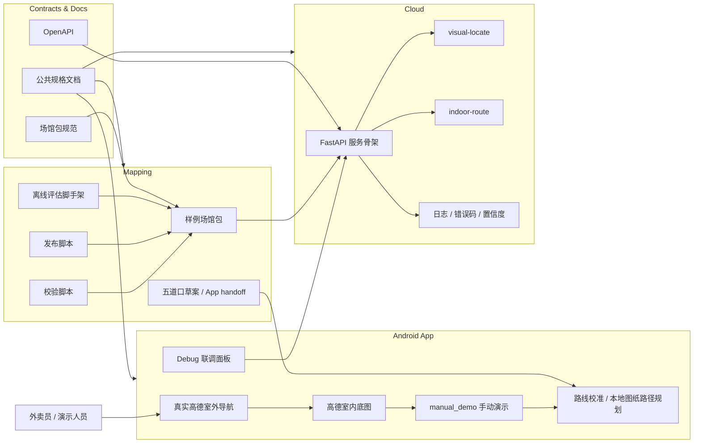
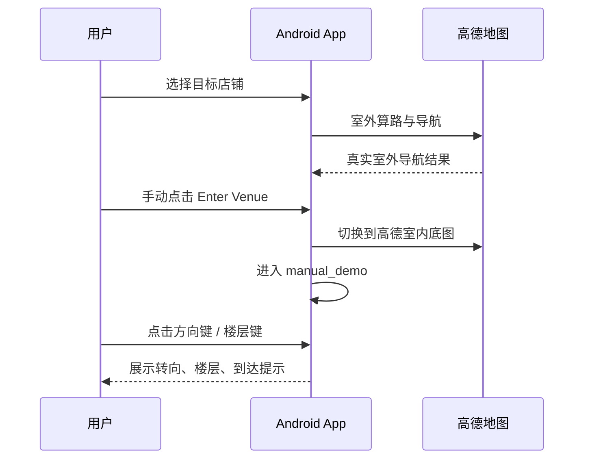
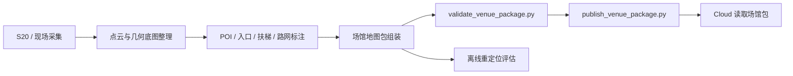
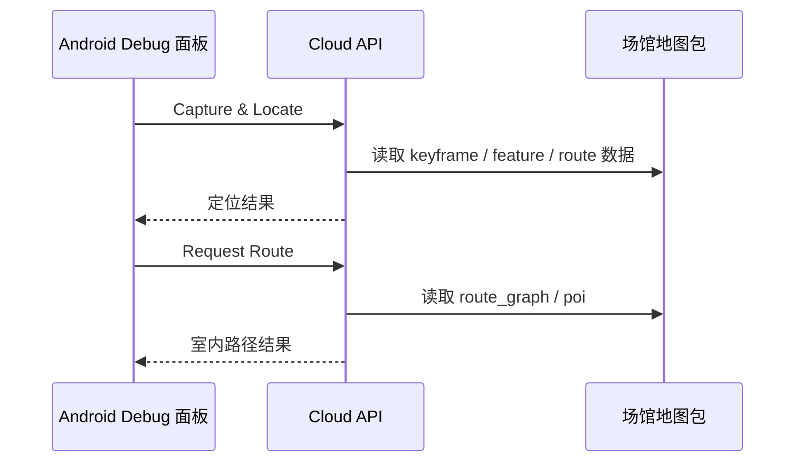
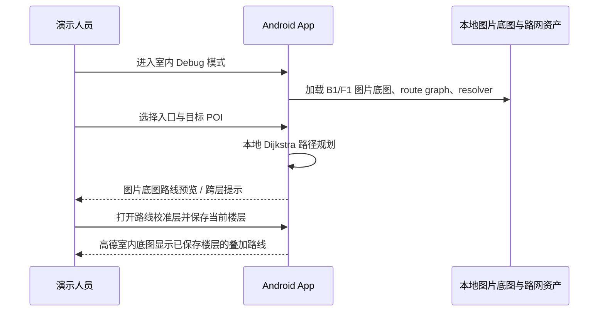

# AI 智能眼镜系统架构草图 + 模块清单 + MVP 里程碑 V0.1

更新时间：2026-05-09

## 1. 文档目的

本文档用于把当前仓库的系统结构、模块边界和里程碑状态收口成一份统一视图，重点反映“当前默认演示链路”和“仓库内保留能力”的真实关系。

## 2. 当前架构假设

- 当前主交互终端是 Android 手机 App
- 当前室外主链路已经接入真实高德导航
- 当前室内主链路已经收口为高德室内底图 + `manual_demo`
- 当前五道口样例场馆已固化为默认室内演示脚本
- 当前 Android 已接入室内路线校准层和五道口 B1/F1 本地图纸路径规划调试能力
- 当前云端视觉重定位与室内路径规划能力保留在代码和 Debug 面板中，但默认不作为室内主演示流程
- 当前样例场馆包、五道口 route-only 草案和工具链已具备，真实场馆正式包尚未完整入库

## 3. 架构原则

- 当前默认演示链路优先稳定可演示，不追求自动化完整度
- Android 负责当前用户可见体验
- Cloud 负责保留的接口和算法联调底座
- Mapping 负责真实场馆包、校验和离线评估工具
- Contracts 与 Docs 负责三方共享事实源

## 4. 系统架构草图

### 4.1 总体架构

### 4.2 当前默认演示链路

### 4.3 离线地图生产链路

### 4.4 保留的云端调试链路

### 4.5 当前本地图纸路径规划调试链路

## 5. 模块清单

| 子项目 | 模块 | 当前职责 | 当前状态 |
| --- | --- | --- | --- |
| Android | 室外导航壳子 | 真实高德室外路线与导航 UI | 已可用 |
| Android | 室内底图壳子 | 高德室内地图、楼层切换、手动入场 | 已可用 |
| Android | `manual_demo` | 方向键、楼层键、重置、退出、状态卡 | 已可用 |
| Android | 路线校准层 | 当前路线拖动、缩放、翻转、复制 CSV、本机保存与复用 | 已可用 |
| Android | 本地图纸路径规划 Debug | 五道口 B1/F1 图片底图、resolver 搜索、Dijkstra 路径与跨层提示 | 已可用 |
| Android | Debug 面板 | 健康检查、元数据、定位、路径、模拟低置信度与 fallback | 已可用 |
| Cloud | API 服务骨架 | 健康检查、场馆元数据、定位、路径规划接口 | 已可联调 |
| Cloud | 重定位 baseline | 保留的视觉重定位原型与评估接口 | 已保留 |
| Cloud | 路径规划 baseline | 基于场馆包的室内路径规划 | 已保留 |
| Mapping | 样例场馆包 | 样例楼层、POI、入口、路网、定位资产占位 | 已提供 |
| Mapping | 五道口 route-only 草案 | TATA 手动演示路线、QGIS 标注层、App handoff 数据 | 已提供 |
| Mapping | 校验脚本 | 检查场馆包字段、引用与资源 | 已提供 |
| Mapping | 发布脚本 | 校验并打包样例或真实场馆包 | 已提供 |
| Mapping | 离线评估脚手架 | 批量评估与失败样本导出 | 已提供 |
| Contracts | OpenAPI | Cloud 接口契约 | 已提供 |
| Contracts | 场馆包规范 | 共享数据结构与命名约束 | 已提供 |

## 6. MVP 里程碑

### M0 文档与契约基线

- 状态：已完成
- 结果：PRD、开发规格、OpenAPI、场馆包规范和子项目文档已建立

### M1 Android 室外真实导航

- 状态：已完成
- 结果：真实高德室外导航、搜索、当前位置、全览、朝向切换已可运行

### M2 Android 室内手动演示

- 状态：已完成
- 结果：高德室内底图、`Enter Venue`、`manual_demo`、五道口 TATA 默认脚本、方向键、楼层键和退出室内已可运行

### M3 Cloud 与 Mapping 保留联调底座

- 状态：已完成
- 结果：Cloud 接口工程、错误码、日志、样例场馆包、五道口草案交付物、校验/发布脚本、离线评估脚手架已具备

### M4 首个真实场馆包

- 状态：未完成
- 结果定义：真实场馆楼层、入口、目标店铺、主路线和图片资产入库

### M5 恢复真实室内自动定位主链路

- 状态：未完成
- 结果定义：在真实场馆包基础上，把云端重定位与室内路径规划恢复为默认可演示链路

## 7. 当前里程碑判断口径

当前项目应按顺序理解为：

1. 演示壳子已成立
2. 室外真实导航已成立
3. 五道口样例场馆的室内手动演示已成立
4. 本地图纸路径规划与路线校准调试链路已成立
5. 云端与建图底座已保留
6. 真实场馆自动化链路尚未恢复

这意味着当前仓库已经可以演示，但还不能把“真实室内自动重定位导航已可用”写成现状。
